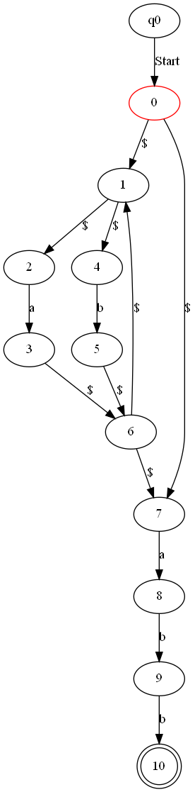
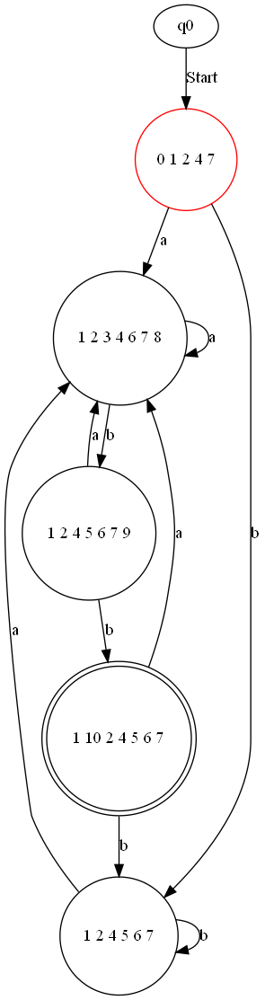

# Finite Automata Conversion and Visualization

A Python coursework prototype from the July 2022 summer camp at Beijing University of Posts and Telecommunications. It explores epsilon closures, NFA-to-DFA subset construction and Graphviz state-transition diagrams.

## Included work
- `test3.py`: original conversion and visualisation implementation.
- `data1.txt`, `data2.txt`: small automaton input examples.
- `NFA.gv`, `DFA.gv` and PNGs: historical diagram outputs supplied with the project (not newly generated verification results).




## Run locally
Install Python and the Graphviz desktop command-line tools (`dot` must be on PATH), then run from the repository root:

```sh
python -m venv .venv
# Activate the virtual environment using your shell's activation command.
python -m pip install -r requirements.txt
python test3.py
```

The program reads `data2.txt`, writes diagrams and opens an image viewer. Input line 1 lists start states; line 2 lists accepting states; each following line is `source symbol destination`. `$` represents epsilon. Use a plain text file without blank lines between records.

## Scope and known limitations
This is the historical prototype, not a general-purpose automata library. The original epsilon-transition code uses `extend` on a state name, so multi-character epsilon destinations can be split incorrectly. Its traversal starts from the first encountered state rather than the union of all declared start states. Empty DFA states are omitted. PDA and Turing-machine execution are not implemented. These limitations are retained and documented rather than silently presenting a rewritten algorithm as the original coursework.

## 中文简介
读取状态转移描述，计算 epsilon 闭包并生成 NFA / DFA 状态图。保留原始实现，已知边界问题见上文。
